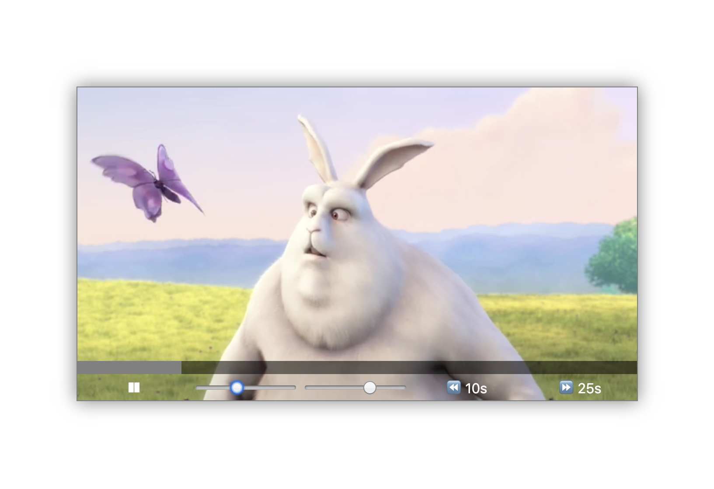

# 11. Custom Video Player

#### _Custom Video Player by JavaScript30 10/15/19_

## Description
This is Custom Video Player, 11th application out of 30 by 30 day Vanilla JavaScript Coding Challenge by Wes Bos.<br>
Please check the challenge from [JavaScript30](http://wesbos.com/javascript30/).




## About this Application:
1. Click the video screen or play button to start the video.
2. Click the screen again then the video will pause.
3. You can fast-forward(25 seconds) or rewind the video(10 seconds).
4. Check how the sliders work.

## Setup/Installation Requirements

1. Clone this repo:
```
$ git clone https://github.com/misakimichy/JS30-11-custom-video-player.git
```

2. Navigate to the top level of the cloned directory.

3. Open `index.html` with your preferred web browser.

## Known Bugs
* No known bugs at this time.

## Support and contact details
 I welcome any feedbacks and comments: misaki.koonce@gmail.com

## Technologies Used
_Git, GitHub, HTML, CSS, Vanilla JavaScript

## License
Copyright © 2019 under the MIT License